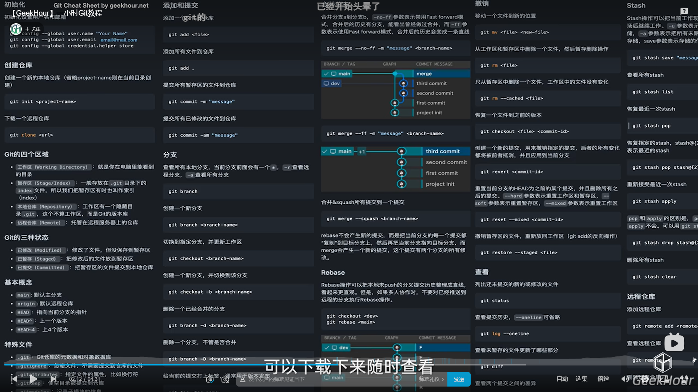
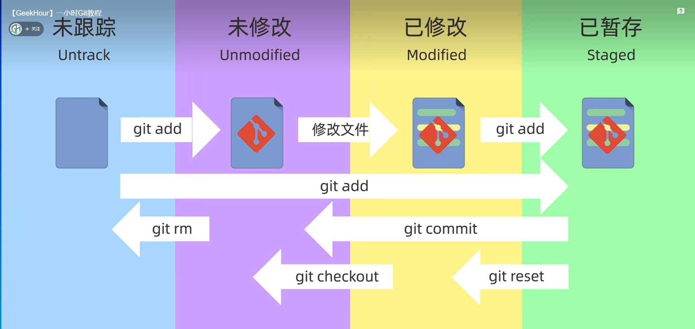

# git

## 一、安装和初始化

查看git版本

```
$ git -v
>>>git version 2.44.0.windows.1
```



初始化命令

```
$ git config --global user.name "LinShen" # 配置用户名
$ git config --global user.email linshen@qq.com # 配置用户名和邮箱
$ git config --global credential.helper store # 保存密码
$ git config --global --list # 查看git配置信息
```

## 二、仓库

### 1、创建一个仓库.git

- 法一：直接创建一个仓库

```
$ git init
--------------------
$ git init my-repo # 在当前目录下创建一个文件夹my-repo，并将其作为仓库
```

- 法二：从远程服务器上克隆一个已经存在的仓库

```
$ git clone
--------------------
$ git clone https://github.com/XXXXX/remote-repo.git # 从该链接创建一个名为remote-repo的远程仓库
```

- 查看.git仓库内文件的信息（其中a表示显示隐藏内容，l表示显示详细信息）

```
$ ls -a
```

### 2、工作区域和文件状态



### 3、添加和提交文件

```
$ git status # 查看工作区内文件的状态
$ git ls-files # 查看暂存区的文件内容
$ git add file1.txt # 将file1.txt文件提交到暂存区
$ git add *.txt
$ git add . # 将所有的修改添加到暂存区
$ git rm --cached file1.txt # 将添加到暂存区的file1.txt文件取消回工作区域
$ git commit -m "第一次提交" # 将暂存区的文件提交到仓库中，并提交信息为第一次提交
$ git commit -am "第一次提交" # 将工作区的文件提交到仓库中，并提交信息为第一次提交
```

### 4、查看提交记录

```
$ git log # 查看提交记录（每次提交都有一个唯一的提交ID、作者、邮箱和注释信息）
$ git log --oneline # 查看简洁的提交记录
```

### 5、回退版本

```
$ git reset --soft ID# 回退到对应提交ID的版本
$ git reset --hard ID# 在回退的操作后丢弃工作区和暂存区的内容
$ git reset --mixed ID# 在回退的操作后丢弃暂存区的内容
```

### 6、查看版本差异

```
$ git reflog # 查看操作指令的历史记录
$ git diff # 比较文件的差异化内容，默认是比较工作区和暂存区的内容
$ git diff HEAD # 比较工作区和仓库的差异化内容
$ git diff --cached # 比较暂存区和仓库的差异化内容
$ git diff ID1 ID2 # 比较两份提交ID版本的差异化内容
$ git diff ID1 HEAD # 比较提交ID版本为ID1与仓库的差异化内容
$ git diff HEAD^ HEAD 或$ git diff HEAD~ HEAD # 比较仓库中上一个版本与仓库中当前版本的差异化内容
$ git diff HEAD~2 HEAD # 比较仓库中上两个版本与仓库中当前版本的差异化内容
$ git diff HEAD~2 HEAD file3.txt # 比较仓库中上两个版本与仓库中当前版本的file3.txt差异化内容
```

### 7、删除文件

```
$ rm file1.txt # 在工作区删除file1.txt文件
$ git rm file2.txt # 在工作区和暂存区同时删除file2.txt文件
$ git rm --cached file3.txt # 在暂存区删除file3.txt文件
$ git rm -r* # 递归删除某目录或文件
```

## 三、.gitignore文件

### 1、应该忽略的一些文件（未被添加到暂存区的文件）

- 系统或软件自动生成的文件
- 编译产生的中间文件和结果文件
- 运行时生成日志文件、缓存文件、临时文件
- 涉及身份、密码、口令、秘钥等敏感信息文件

### 2、.gitignore文件的内容

```.gitignore
access.log
*.log
temp/
```

### 3、.gitignore文件的匹配规则

- 空行或者以#开头的行会被git忽略
- 使用标准的Blob模式匹配：
  - *：任意字符
  - ？：单个字符
  - [] ：匹配列表中的单个字符
- **表示匹配任意的中间目录
- ! ：表示取反

## 四、远程仓库的使用

### 1、github仓库的创建

- 可选是否添加README.md文件和.gitignore文件

- 可选择是否添加license

## 2、github的SSH配置和克隆仓库

- 生成用户目录下的.ssh文件

  - -t rsa ：表示制定秘钥类型为RSA
  - -b 4096 ：表示秘钥长度为4096位

      ```win+R
      $ ssh-keygen -t rsa -b 4096 -C "1325240194@qq.com"
      Generating public/private rsa key pair.
      Enter file in which to save the key (/c/Users/LINSHEN/.ssh/id_rsa):
      Created directory '/c/Users/LINSHEN/.ssh'.
      Enter passphrase (empty for no passphrase):
      Enter same passphrase again:
      Your identification has been saved in /c/Users/LINSHEN/.ssh/id_rsa
      Your public key has been saved in /c/Users/LINSHEN/.ssh/id_rsa.pub
      The key fingerprint is:
      SHA256:OjHArqtVSRBL39DQO8qmw9wFdLvidP6kzfgZc69OU5s 1325240194@qq.com
      The key's randomart image is:
      +---[RSA 4096]----+
      |  +.o+           |
      | . =.o+          |
      |  ..=..o         |
      |   o.o+          |
      |   .+oooS   .    |
      |   o* ++   . o   |
      | oo* =o + + E    |
      | .=.o .B * o     |
      |....  oo*.o..    |
      +----[SHA256]-----+
      ```

- 生成的公钥（id_rsa.pub）和私钥文件（id_rsa）

  - 私钥文件：保密不公开
  - 公钥文件：用于上传到github

- 在github上配置SSH keys

  - 将公钥文件里的内容复制粘贴到SSH and GPG keys的keys中

- 注意项

  - 若第二次则需指定新文件目录

  - 指定新的生成目录

    ```
    ssh-keygen -t rsa -b 4096 -C "1325240194@qq.com"
    Generating public/private rsa key pair.
    Enter file in which to save the key (/c/Users/LINSHEN/.ssh/id_rsa):test
    ```

  - 配置新生成的test公钥和私钥文件

    ```
    vi test.pub
    tail -5 config
    #github
    Host github.com
    HostName github.com
    PreferredAuthentications publickey
    IdentityFile ~/.ssh/test
    ```

### 3、关联本地仓库和远程仓库

- 查看远程仓库信息

  ```
  $ git remote -v
  ```

- 更新和拉取

    ```
    $ git push <remote><branch> # 推送更新内容
    $ git pull <remote> # 拉取更新内容
    ```

- 关联本地现存仓库和远程仓库

  ```
  $ git remote add origin <remote> #远程仓库的默认别名一般为origin 
  $ git branch -M main # 指定分支名称为main
  $ git push -u origin main:main # 把本地main分支和远程的main分支关联起来
  ```

### 4、gitee和GitLab

- gitee的优势：国内网站，访问速度较快
- GitLab的优势：私有化部署

## 五、分支

### 1、基本操作

- git branch指令：查看与创建分支

  ```
  $ git branch # 查看当前仓库的所有分支
  $ git branch dev # 创建一个分支名为dev的分支
  ```

- git checkout指令：切换分支以及恢复文件状态

  ```
  $ git checkout dev # 切换到dev分支
  ```

- git witch指令：切换分支

  ```
  $ git switch main
  ```

- git merge指令：合并分支

  ```
  $ git merge dev # 将dev分支合并到执行该命令的分支中
  ```

- git log指令：查看分支图

  ```
  $ git log --graph --oneline --decorate --all # 查看分支合并过程
  $ alias graph="git log --graph --oneline --decorate --all" # 给上述命令指定一个新的别名
  $ graph
  ```

- git branch -d指令：删除已经完成合并的分支

  ```
  $ git branch -d dev # 删除已经完成合并的dev分支
  $ git branch -D dev # 强制删除dev分支
  ```

### 2、分支合并冲突的解决

- 当冲突发生时可通过git status或git diff查看冲突的具体内容（以main1.txt文件冲突为例）

  ```
  $ git diff
  $ vi main1.txt
  $ git add .
  $ git commit -m "merge conflict"
  ```

- git merge --abort指令终止合并

  ```
  $ git merge --abort
  ```

- rebase指令

  ```
  $ git rebase dev # 将main分支中与dev分支共同祖先的部位之后的部位整个移到dev分支末尾
  ```

- reset回退指令

  ```
  $ git reset --hard b4d139 # 表示回退到版本号为b4d139的版本
  ```

## 六、分支管理和工作流模型

### 1、GitFlow模型

- 常见的版本号规则

  - ```
    $ git tag # 给指定的版本添加tag标签
    ```

  - 主版本（Major Version）：主要功能变化或重大更新

  - 次版本（Minor V ersion）：一些新的功能、改进和更新，通常不会影响现有的功能

  - 修订版本（Patch Version）：一些小的bug修复，安全漏洞补丁等。通常不会更改现有的功能和接口

- 主线/基线分支main
  - 只接受来自hotfix和release的合并请求，不允许直接push修改

- 线上版本bug热修复分支hotfix
  - 用于解决线上问题，修复完成后合并并回main分支，命名规则：hotfix-#issueid-desc
- 版本发布分支relese
  - 永久分支，用于发布前的测试和验证
- 开发分支develop
  - 开发分支，所有的功能分支均来自开发分支
- 功能分支feature-login-page
  - 用于开发登录页面的功能
